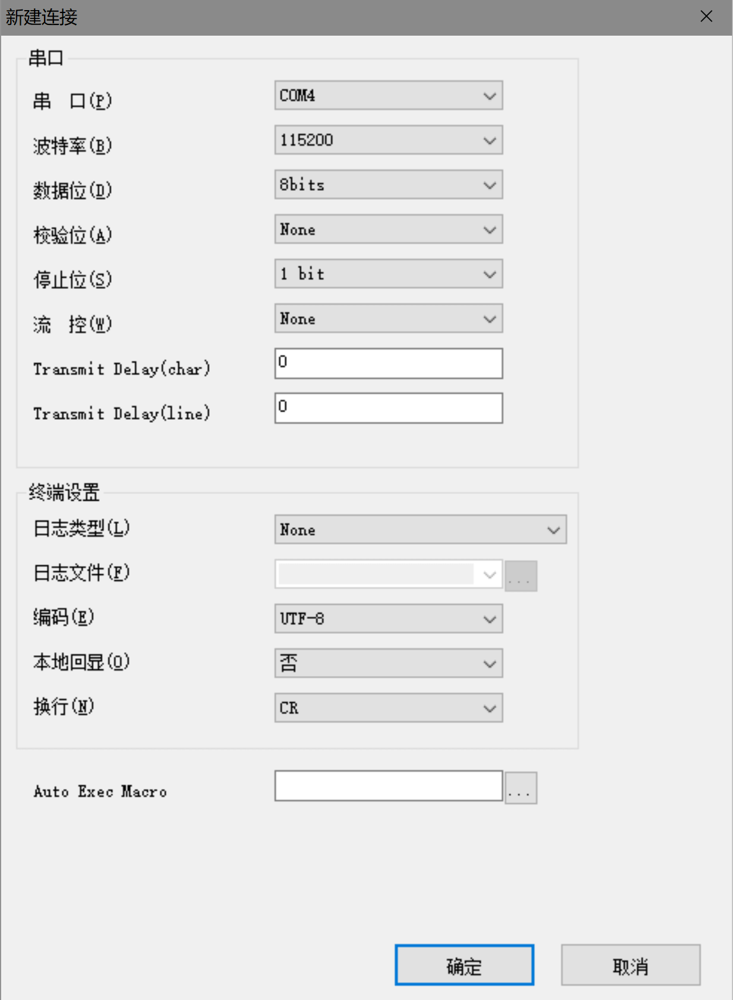
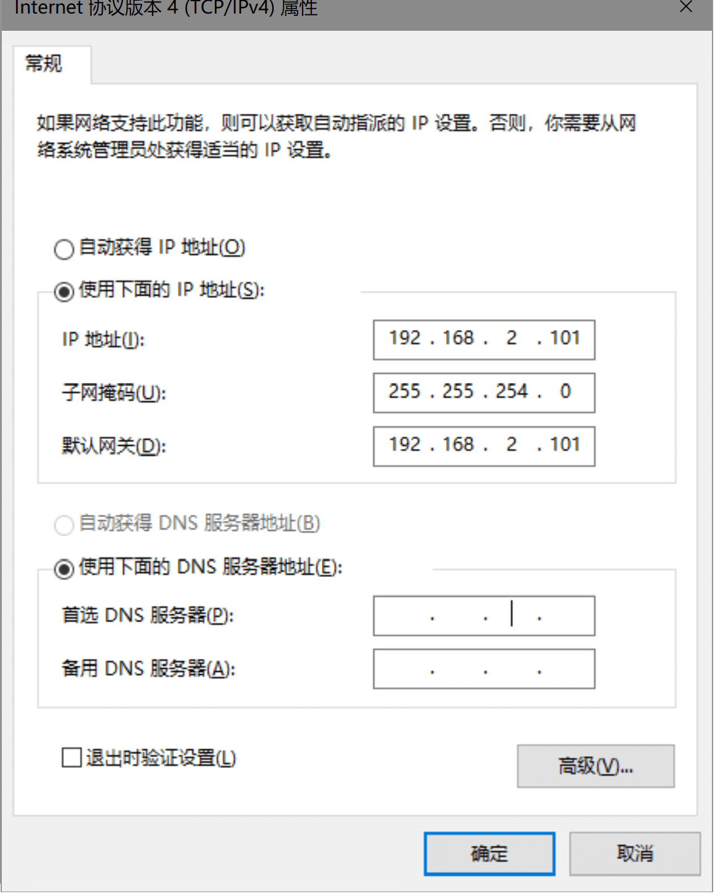
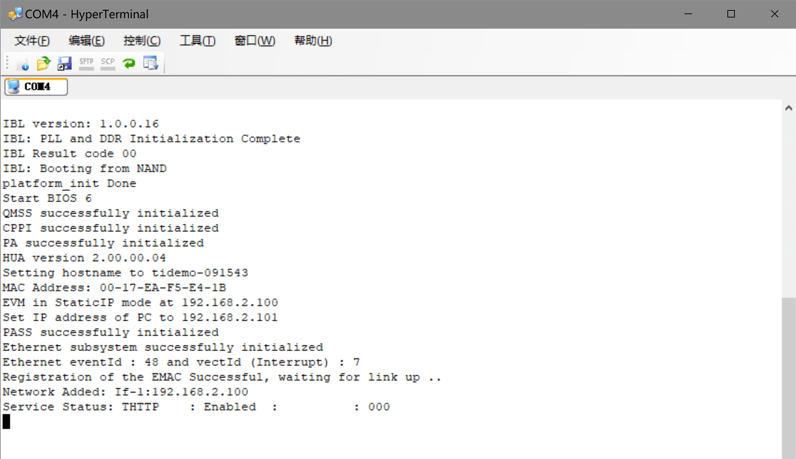
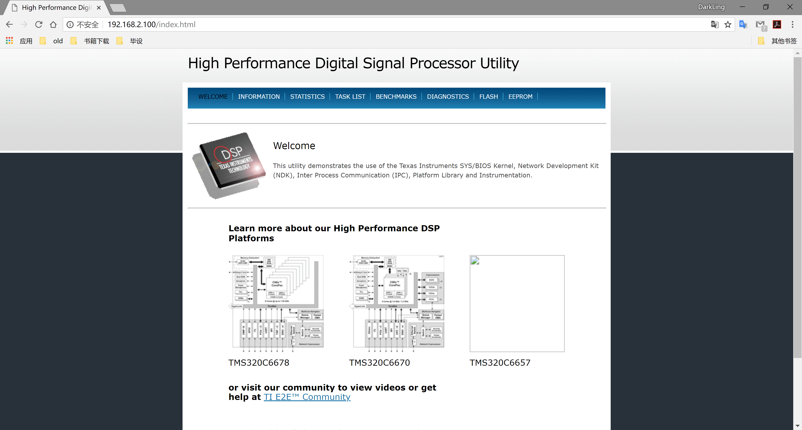

## 1. C6678开发板上手

　　等了一个多月，开发板终于到了。板子型号是TMDSEVM6678LE，带有XDS560v2仿真板(Blackhawk XDS560v2-USB Mezzanine Emulator）。  
　　刚来的板子上已经烧写了一个Out-of-Box(OOB)例程--[HUA（High-Performance DSP Utility Application）](http://processors.wiki.ti.com/index.php/MCSDK_HUA_Demonstration_Guide)。按照默认的启动设置（SW3~SW6、SW9），即0010-1111-1110-0000，SW9：11。SW9的第二个开关是设置HUA例程是使用静态IP还是DHCP方式工作。  
　　由于刚拿到板子，不了解情况，我直接在板子上烧写了其它的程序。自带的HUA工程文件可以在MCSDK安装目录的demo目录中找到。  
　　下面介绍一下让HUA例程跑起来的过程（我使用的是静态IP方式，DHCP方式还需要下载配置DHCP Server）。  
　　前置准备：   
<!--more-->
> 1. windows: [hyperterminal](https://www.hilgraeve.com/hyperterminal-trial/)　　　　linux: minicom   　　*用于接收从串口发出的数据*  
> 安装完运行，PC连接上开发板，新建连接可以看到有COM4选项，设置如下：  
> 
 
  
> tips:  
> TMDSEVM6678LE带有XDS560v2仿真板，这个扩展板的USB-mini口没有和UART口连接，因此不能通过该口接收串口数据。需要自己将这个口（RS-232）连接到PC，或者将560v2拆下，使用板子自带的XDS100v1，自带的仿真器虽然速度慢一些，但是串口是连到USB-mini口的。  
>   
> 2. 同时需要设置PC的ip信息：  
> 

  
　　正式运行：  
　　准备工作完成后，按下板子的FULL_REST开关（靠近网口那个）,可以看到Hyperterminal输出如下：  
　　  
　　在浏览器中输入192.168.2.100：  
　　  

## 2. CCS 安装&使用

　　附带在评估板中的还有一个光盘，光盘中有CCSv5和BIOS_MCSK的安装包。但是CCSv5已经比较老了，许多工程文件都是使用比较新的编译器编译的，因此我在官网下了[CCSv8](http://processors.wiki.ti.com/index.php/Download_CCS#Download_the_latest_CCS)，同时也下了[bios_mcsdk_02_01_02_06](http://software-dl.ti.com/sdoemb/sdoemb_public_sw/bios_mcsdk/latest/index_FDS.html)。  
　　CCS中有几个使用较为频繁的操作：  
1. project > import project  
　　将已有的工程文件导入，导入后可以在 *view > project explorer*操作打开的窗口中看到导入的工程。  
2.  view > target configurations  
　　打开目标连接文件窗口，可以看到各个工程文件中的连接文件。在窗口中的ccxml文件中右击鼠标，选择lauch selected configutaion可以用改配置文件连接并启动目标板。启动前最好先双击该文件，在打开的窗口中test configuration看看有无错误。  
3. 下载并执行程序流程：  
　　1) Debug窗口中右击某个core,conect target  
　　2) tool > gel files 。 memory map窗口中，gel files > 右击 >load gel。　　*gel文件是初始化脚本*  
　　3) scripts > evmc6678l init function > global_default_setup  
　　4) run > load > load program > 选择.out文件  
　　5) run > resume 程序开始运行。  
4. 安装新的组件:  
　　window > preference >Code Compose Studio > products > rediscover > install  
　　window > preference >Code Compose Studio > build > compliers > refresh > install
