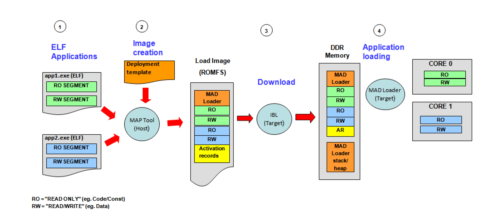
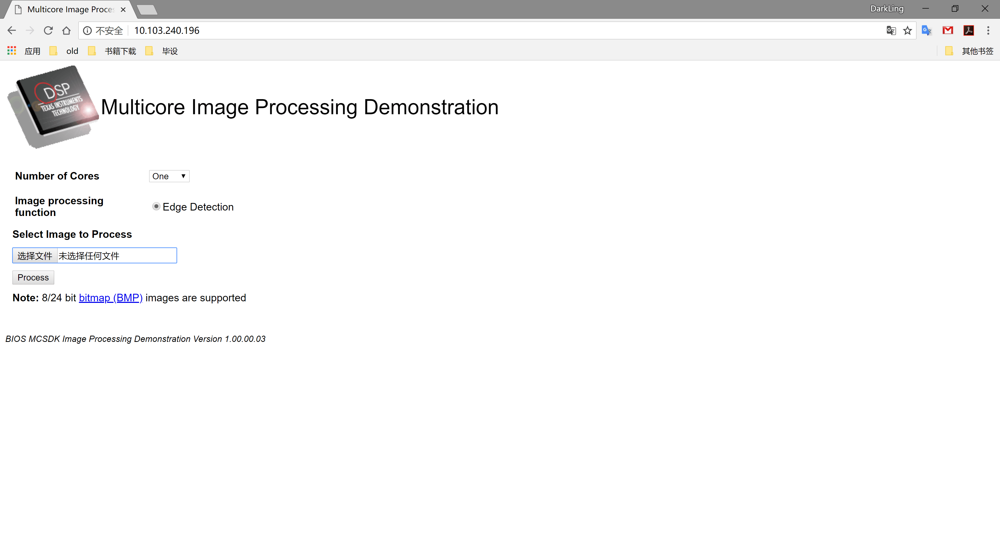
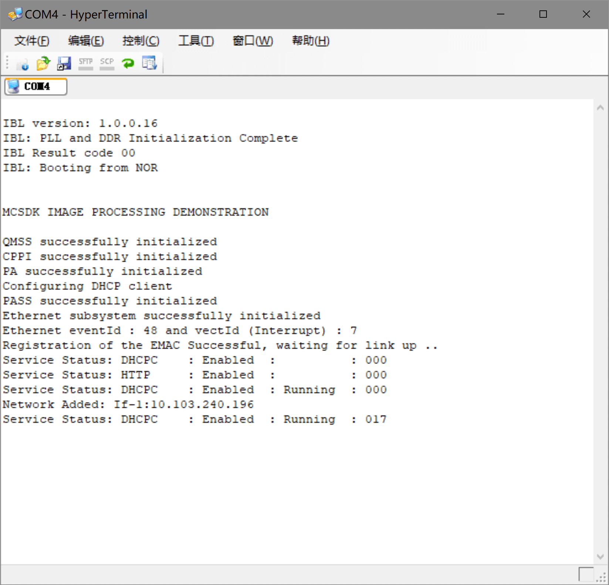
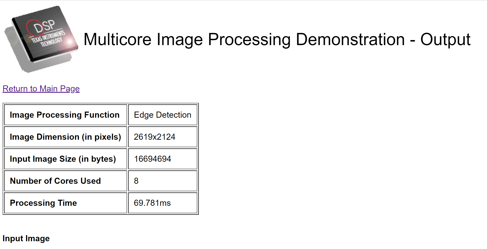
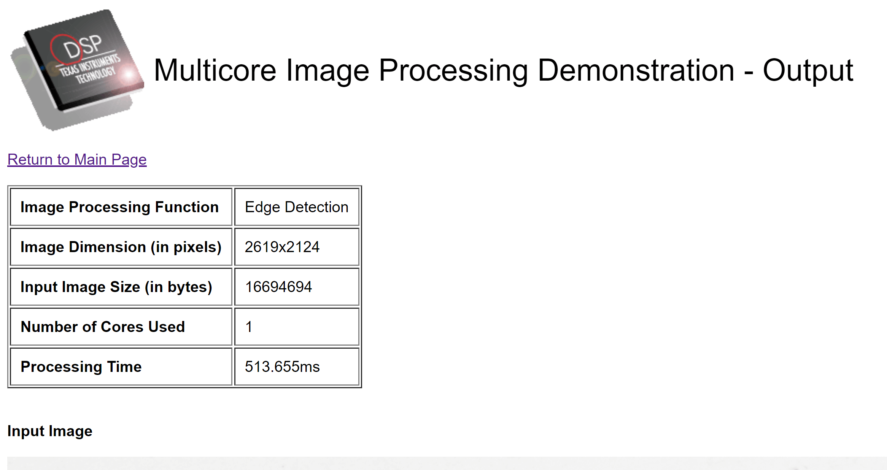

## 利用MAD工具实现多核启动
　　先总体地说一下MAD工具的作用：对于多个DSP核心，可能我们有对应的多个project，生成了多个.out文件，我们想把不同的projecct放在不同的core上运行。调试的时候我们可以通过仿真器手动把代码文件load到对应core上让它运行，但是怎么让板子在启动的时候自动加载代码到各个core上，这就是MAD工具解决的问题。除此之外，这个工具还能通过共享一部分代码文件达到节约内存的目的。
<!--more-->
### MAD（Multicore Application Deployment） 工具
　　MAD工具主要包括两个部分：MAP Tools，MAD Loader。其中MAP Tools主要是在构建镜像文件时使用（.bin，Build Time Utility），MAD Loader主要是在板子上电启动之后，负责将镜像文件搬到各个core的内存上，并让各个core从起始代码段开始执行。  
　　同时，MAD工具还有两种使用模式：Prelinker-bypass， Prelinker。Prelinker-bypass模式下，MAP Tools不会为应用程序的各个段分配内存，也不会进行地址绑定（调用prelinker），这同时也就要求我们已经提前将这些工作做好了。Prelinker模式下，则相反，会通过deploy.json配置文件进行相关的配置。

  <div align=center></div>  
  
　　[具体介绍](http://processors.wiki.ti.com/index.php/MAD_Utils_User_Guide)。
　　
### image_processing 例程  
　　该例程位于mcsdk >demos >image_processing >utils >mad >evmc6678l下。默认在images目录下，已经有生成好的mcip-plbp-c6678-le.bin文件了，可以直接使用该文件，将其烧写到nor flash上，并进行一定的配置（后述），便可以在板子上跑起来该多核例程。效果如下：
<div align=center></div>  
　　由于该例程使用网线完成图片的传输，因而需要像之前的HUA例程一样进行配置，之前我使用的是静态IP方式，这次使用DHCP方式，该方式需要将板子的网线接到路由器，由路由器的DHCP server来给板子分配IP，板子启动时com4的界面如下：  
<div align=center></div>  
　　上图中的IP地址即为板子的IP，可以在浏览器中通过该IP访问到第一个图的网页。  
　　这个例程的功能就是，对图片（只支持bmp图片，可以将图片在画图中打开，另存为bmp图片）进行边缘检测处理,可以选择使用几个dsp核心对图片进行处理，可以看到使用的core越多，速度越快，处理结果（效果似乎一般）及对比如下：  
<div align=center></div>  
<div align=center></div>  
<div align=center></div>  

　　下面说一下利用该目录下，config-files目录下的配置文件，使用MAP Tools工具重新生成mcip-plbp-c6678-le.bin的流程.  
> windows环境中需要安装mingw、python和Msys（模拟GNU环境）这个步骤另开blog记录吧。  
> 修改build_mad_image.bat自动生成脚本,如下根据自己的编译器地址修改目录  

```
@set PATH="C:\ti\ccsv8\tools\compiler\c6000_7.4.23\bin";%PATH%

@rd /s /q tmp

python2 ..\..\..\..\..\tools\boot_loader\mad-utils\map-tool\maptool.py config-files\maptoolCfg_evmc6678l.json

```

> 修改maptoolCfg_evmc6678l.json配置文件  

```JavaScript
{
    "deploymentCfgFile"     : "config-files/deployment_template_evmc6678l.json",
    "LoadImageName"         : "mcip-c6678-le.bin",
    "prelinkExe"            : "prelink6x",
    "stripExe"              : "strip6x",
    "ofdTool"               : "ofd6x",
    "malApp"                : "../../../../../tools/boot_loader/mad-utils/mad-loader/bin/C6678/le/mal_app.exe",
    "nmlLoader"             : "../../../../../tools/boot_loader/mad-utils/mad-loader/bin/C6678/le/nml.exe"
}

```
> 修改deployment_template_evmc6678l.json文件,注意原文件中，L2SRAM段中的secnamepat中缺少了"nimu_eth_ll2"，不加上会报错。

```JavaScript
{
	"deviceName" : "C6678",
	
	"partitions" : [
		{
			"name"		: "DDR3-ROMFS",
			"vaddr"		:  "0x9e000000",
			"paddr"		: [ "0x81e000000", "0x81e000000", "0x81e000000", "0x81e000000", "0x81e000000", "0x81e000000", "0x81e000000", "0x81e000000"] ,
			"size"		: "0x1000000",
			"secNamePat"  	: ["text", "const"],
			"cores"		: [0,1,2,3,4,5,6,7],
			"permissions"	: ["UR", "UX", "SR", "SX"],  
			"cacheEnable"	: true,
			"prefetch"      : true,
			"priority"	: 0,
			"shared"	: true,
			"loadPartition" : true 
		},
		{
			"name"		: "DDR3-HEAP",
			"vaddr"		:  "0x88000000",
			"paddr"		: ["0x808000000"] ,
			"size"		: "0x8000000",
			"secNamePat"  	: ["systemHeapMaster"],
			"cores"		: [0],
			"permissions"	: ["UR", "UW", "SR", "SW"],  
			"cacheEnable"	: true,
			"prefetch"      : true,
			"priority"	: 0,
			"shared"	: true
		},
		{
			"name"		: "DDR3-DATA",
			"vaddr"		:  "0x82000000",
			"paddr"		: ["0x802000000"] ,
			"size"		: "0x1000000",
			"secNamePat"  	: ["WEBDATA"],
			"cores"		: [0],
			"permissions"	: ["UR", "UW", "SR","SW"],  
			"cacheEnable"	: true,
			"prefetch"      : true,
			"priority"	: 0,
			"shared"	: true
		},
		{
			"name"		: "MSMCSRAM_MASTER",
			"vaddr"		: "0xc000000",
			"paddr"		: [ "0xc000000"],
			"size"		: "0x100000",
			"secNamePat"  	: [ "emacComm", "NDK_PACKETMEM", "NDK_OBJMEM"],
			"cores"		: [0],
			"permissions"	: ["UR", "UW", "UX", "SR", "SW", "SX"],
			"cacheEnable"	: true,
			"prefetch"      : true,
			"priority"	: 0,
			"shared"	: false
		},
		{
			"name"		: "L2SRAM",
			"vaddr"		: "0x800000",
			"paddr"		: [ "0x800000", "0x800000", "0x800000", "0x800000", "0x800000", "0x800000", "0x800000", "0x800000" ],
			"size"		: "0x80000",
			"secNamePat"  	: [ "resmgr", "cio", "args", "cppi", "qmss", "^\\.far\\.", "bss", "neardata", "rodata", "fardata", "defaultStackSection", "stack", "plt", "platform_lib", "vecs", "switch","nimu_eth_ll2"],
			"cores"		: [0,1,2,3,4,5,6,7],
			"permissions"	: ["UR", "UW", "UX", "SR", "SW", "SX"],
			"cacheEnable"	: false,
			"prefetch"      : false,
			"priority"	: 0,
			"shared"	: false
		}
    ],
	
	"applications" : [
		{
			"name"		 : "master",
			"fileName"       : "../../../ipc/evmc6678l/master/Debug/image_processing_evmc6678l_master.out",
			"libPath"        : "../../../ipc/evmc6678l/master/Debug",
			"allowedCores"   : [0]
		},
		{
			"name"		 : "slave",
			"fileName"       : "../../../ipc/evmc6678l/slave/Debug/image_processing_evmc6678l_slave.out",
			"libPath"        : "../../../ipc/evmc6678l/slave/Debug",
			"allowedCores"   : [1,2,3,4,5,6,7]
		}
	],
	
	"appDeployment" : [
		"master",
		"slave",
		"slave",
		"slave",
		"slave",
		"slave",
		"slave",
		"slave"
	]
}


```

修改好后，再msys中输入： 
> cd /c/ti/mcsdk_2_01_02_06/demos/image_processing/utils/mad/evmc6678l/  
> ./build_mad_image.bat  

可以看到再images目录下生产了.bin文件。接下来需要将.bin文件烧写到nor flash中，由于我使用的是IBL NOR Flash启动方式，还需要对IBL进行一定的配置:
> startAddress = 0x9e000000  
> branchAddress = 0x9e001040

按照之前配置IBL的方法将norflash中的上述部分修改成上面的地址。然后利用nor writer将.bin文件烧入nor flash。将网线连接到路由器，启动板子，可以看到上面的效果。


## Led_play 例程
　　除了上面的例程外，我还从网上下载了Led灯闪烁例程，并且自己修改成两个核上运行程序，但是由于例程中的一些问题，使得程序一直无法正常运行，后来查找到问题，修改后正常工作。  
　　首先是将Led_play例程改成循环点亮改成单灯闪烁。
```C
    for (i = 0; i < length; i++) {
        if (platform_uart_write(message[i]) != Platform_EOK) {
            return;
        }
    }

    for (i=0;i<p_info.led[PLATFORM_USER_LED_CLASS].count;i++)
    {
        platform_led(i, PLATFORM_LED_OFF, PLATFORM_USER_LED_CLASS);
    }
    while(1) {
        platform_led(led_no, PLATFORM_LED_ON, PLATFORM_USER_LED_CLASS);
        platform_delay(150000);
        platform_led(led_no, PLATFORM_LED_OFF, PLATFORM_USER_LED_CLASS);
        platform_delay(150000);
        //led_no = (led_no) % p_info.led[PLATFORM_USER_LED_CLASS].count;
    }
```  

　　接着，修改例程中导致程序无法在core0以外运行的错误:

```C
    //memset(&init_flags, 0x01, sizeof(platform_init_flags));  错误
    memset(&init_flags, 0x00, sizeof(platform_init_flags));
    memset(&init_config, 0, sizeof(platform_init_config));
```  
　　原来的初始化代码会导致将程序在load到core0以外的core时，会abort，无法运行。（因此我利用MAP生成的.bin一直无法正常工作，我还以为时MAP工具配置的问题，查找了很久，最后才发现~……~，一开始在core0正常运行了，就想当然地认为能正常在其它core上跑，事实证明不能想当然~_~）。


## 补充
### 预览生成的.bin文件执行效果

　　生成的.bin文件可以在CSS中先测试是否能够正常使用。步骤如下：
> 1. 连接core0，执行C6678L.gel初始化脚本。  
> 2. 在memory browser中输入0x9E000000,Load memory，将.bin文件烧写进去。  
> 3. 点击core0，在Register窗口中找到PC寄存器，将其值改为0x9E001040。  
> 4. run >resume  

　　这样可以看到多核程序正常跑起来。

### 单镜像
　　MAD方式可以将多个镜像连接成一个，并自动将数据加载到各个core指定的内存上，除了这个方法外，还可以将同一份代码同时加载到多个core的内存中，并通过代码判断当前的核心，从而执行不同的程序。但是具体还没实践过，留待实验。

### MAD启动流程
　　[参考一](https://e2e.ti.com/support/dsp/c6000_multi-core_dsps/f/639/t/346728?Does-program-always-start-from-core-0-for-C6678-)  
　　[参考二](https://e2e.ti.com/support/dsp/c6000_multi-core_dsps/f/639/t/233429?Some-questiones-about-bootloader-in-C6678)  
　　Rom bootloader会在所有的core上运行，但是执行不同的功能。在core0,会执行真正的boot loader；在core1，会执行一条idle指令，等待core0将其唤醒。  
　　IBL存储在EEPROM上，有RBL启动执行，但是IBL只在core0上执行。  
　　启动时RBL启动IBL并执行，IBL将NOR FLASH上的MAD image下载到DDR上，同时由上面配置IBL的步骤可以知道，接下来IBL会跳转到一个执行程序入口地址，在该配置下，就是MAD Loader。  
　　MAD Loader的责任就是解析ROMFS image，将各个数据段加载到它们的执行地址，并在各个指定的core上启动程序的执行。（MAD Loader帮我们完成了唤醒其它core执行的任务）
