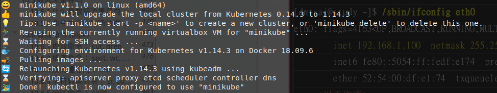
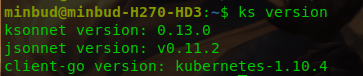
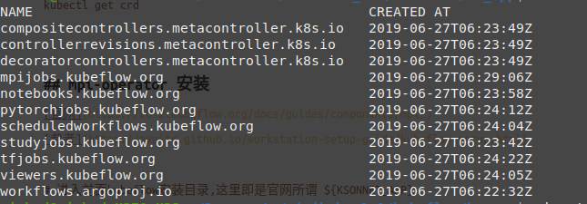
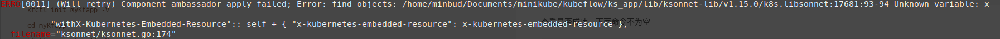

# minikube & kubeflow & mpi-operator 本地ubuntu安装

## kubectl 安装
由于搭建过程中出现的问题，所以我没有装最新版而是装v1.14.3
```
curl -LO https://storage.googleapis.com/kubernetes-release/release/v1.14.3/bin/linux/amd64/kubectl
chmod +x ./kubectl
sudo mv ./kubectl /usr/local/bin/kubectl
```
<!--more-->

## minikube 安装
[官网](https://kubernetes.io/docs/tasks/tools/install-minikube/)  
后面安装需要安装有virtualbox：[参考](https://linuxhint.com/install-virtualbox-arch-linux/)  [更正：其实不需要virtualbox]  
装的是v1.1.0版  
下载软件包，并复制到/usr/local/bin目录下：
```
curl -Lo minikube https://storage.googleapis.com/minikube/releases/v1.1.0/minikube-linux-amd64
chmod +x minikube
sudo cp minikube /usr/local/bin/
rm minikube
```
查看是否成功
```
minikube version
minikube status
```

## 通过minikube安装k8s
默认内存是2G，后面出现问题发现是内存不足，改为4G
```
minikube start --kubernetes-version v1.14.3 --memory 4096
```


## ksonnet 安装
```
wget https://github.com/ksonnet/ksonnet/releases/download/v0.13.0/ks_0.13.0_linux_amd64.tar.gz
tar -xvf ks_0.13.0_linux_amd64.tar.gz
chmod +x ks_0.13.0_linux_amd64/ks
sudo cp ks_0.13.0_linux_amd64/ks /usr/local/bin/ks
```
查看版本
```
ks version
```


## kfctl 安装
```
wget https://github.com/kubeflow/kubeflow/releases/download/v0.5.1/kfctl_v0.5.1_linux.tar.gz
tar -xvf ~/Downloads/kfctl_v0.5.1_linux.tar.gz
```
kfctl 不会存在环境变量中，需要手动添加：
```
export PATH=$PATH:【kfctl路径在此】
```

## kubeflow 安装
[官网](https://www.kubeflow.org/docs/started/getting-started-k8s/#deploy-kubeflow)  
[参考](https://github.com/kubeflow/katib/issues/658)  
官网上的步骤设置了许多环境变量，反而看着很复杂，而且其中有些不必要的，而且kfctl init是没有--config选项的
```
# 创建一个新文件夹，用于操作
cd ~/Documents
mkdir kubeflow
cd kubeflow
mkdir myKfapp

# 开始安装步骤，kfctl需要加到环境变量，或是以./kfctl方式用

# 可能需要等一段时间，耐心等，不要中断它
kfctl init myKfapp -V
cd myKfapp
kfctl generate all -V
kfctl apply all -V
```
查看是否成功，下面命令不为空  
```
kubectl get crd
```

## mpi-operator 安装
[官网](https://v0-2.kubeflow.org/docs/guides/components/mpi/)  
[参考](https://nvaitc.github.io/workstation-setup-guide/kubeflow-setup.html)
```
# 进入前面kubeflow安装目录,这里即是官网所谓 ${KSONNET_APP}
cd ~/Documents/kubeflow/myKfapp/ks_app

# 开始

## 我的kuctl版本是v0.5.1
ks registry add kubeflow github.com/kubeflow/kubeflow/tree/v0.5.1/kubeflow
ks pkg install kubeflow/mpi-job
ks generate mpi-operator mpi-operator
ks apply default -c mpi-operator
```
查看是否成功
```
kubectl get crd
```


至此成功，但是mpi-operator貌似只能在有GPU情况下用，公司配的台式没有。。回去用自己笔记本试试

## 更新GPU版
### nvidia-docker2
[参考](https://github.com/NVIDIA/nvidia-docker)  
minikube支持gpu需要依赖nvidia-docker2  
arch上安装我主要参考了： [arch](https://briancaffey.github.io/2017/11/19/tensorflow-gpu-setup-with-docker-on-arch-linux.html)  
主要就是：
```
yaourt nvidia-docker
systemctl start nvidia-docker
```
### minikube gpu启动
[参考](https://github.com/kubernetes/minikube/blob/master/docs/gpu.md)  
发现其实linux底下安装minikube并不需要virtualbox或vm虚拟机：[参考](https://stackoverflow.com/questions/45753672/why-minikube-needs-a-vm) 

具体步骤：
```
sudo -E minikube start --kubernetes-version v1.14.3 --memory 4096 --vm-driver none --apiserver-ips 127.0.0.1 --apiserver-name localhost

根据提示，可能还需要执行
sudo mv /home/minbud/.kube /home/minbud/.minikube $HOME
sudo chown -R $USER $HOME/.kube $HOME/.minikube
minikube update-context

此时执行
kubectl create -f https://raw.githubusercontent.com/NVIDIA/k8s-device-plugin/v1.10/nvidia-device-plugin.yml
kubectl get nodes -o=custom-columns=NAME:.metadata.name,GPUs:.status.capacity.'nvidia\.com/gpu'
可见
NAME       GPUs
minikube   1
说明成功
```


## 踩的坑
#### 版本问题
[参考](https://github.com/kubeflow/kubeflow/issues/3544)  
一开始 minikue 和 kubectl 用的是最新版本，结果在用kfctl安装kubeflow时报错
```
kfctl apply all -V
```

像参考中改 minikube 为 v1.1.0, kubectl 为 v1.14.3后成功了

#### 路径问题
执行命令出错，发现 ${KSONNET_APP} 指的是创建的: ks_app/
```
ks registry add kubeflow github.com/kubeflow/kubeflow/tree/v0.5.1/kubeflow
```

#### 内存不足
[参考](https://github.com/kubernetes/minikube/issues/4134)  
在装完mpi-operator后发现，minikube status 输出中的api-server 变成error了，过了一会又变成stopped  
参考说是内存不足，minikube虚拟机默认是2G，改为4G就好了
