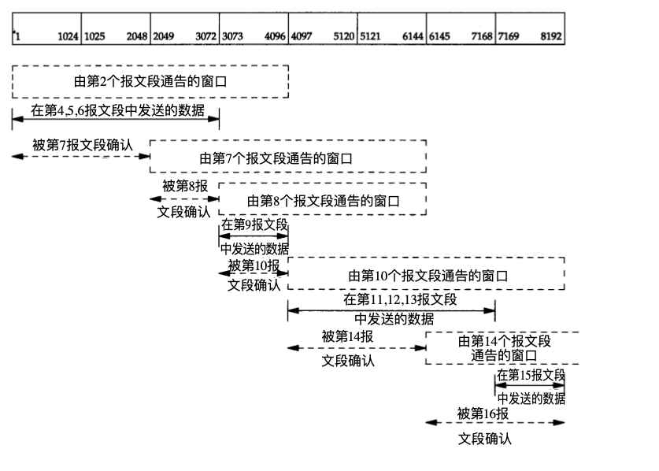

### tcp在高延时网络下的传输速度
　　在高延时且没有出现丢包的情况下，由于滑动窗口机制，如果tcp接收方的流量窗口过小，由于滑动窗口窗口张开原理，会导致单次发送报文耗时基本取决于延迟，传输速度较低。
<!--more-->
　　想象报文的发送过程，发送方的发送窗口在接收到接收方的ACK报文后才会向右移动即张开，但是由于传输延时高，发送窗口中的报文发送完毕后，接收方还没有接收到报文，而且在接收到报文后发送的ACK也需要很长的时间，因而发送
方花费了很长时间在等待报文的ACK。
　　如果发送窗口足够大，发送窗口中的报文刚发送完，就接收到了接收方发送过来的ACK报文，窗口张开向右滑动，这就是理想的状况，即流量控制窗口大小等于时延带宽积，rwnd==bdp（brandwidth-delay product）。
　　这种传输环境也被叫做长肥管道。
下图是TCP/IP详解中的，可以看出窗口动态滑动的过程：

### 可能带来的问题
- 窗口大小限制
TCP首部中窗口大小为16bit，所以窗口大小最大为65535字节，因此窗口大小可能无法增大到满足时延带宽积的要求。
- 序列号重叠
TCP使用32bit来标志传输数据，由于高时延和高传输速度，可能导致有相同序列号的数据同时出现在网络当中
